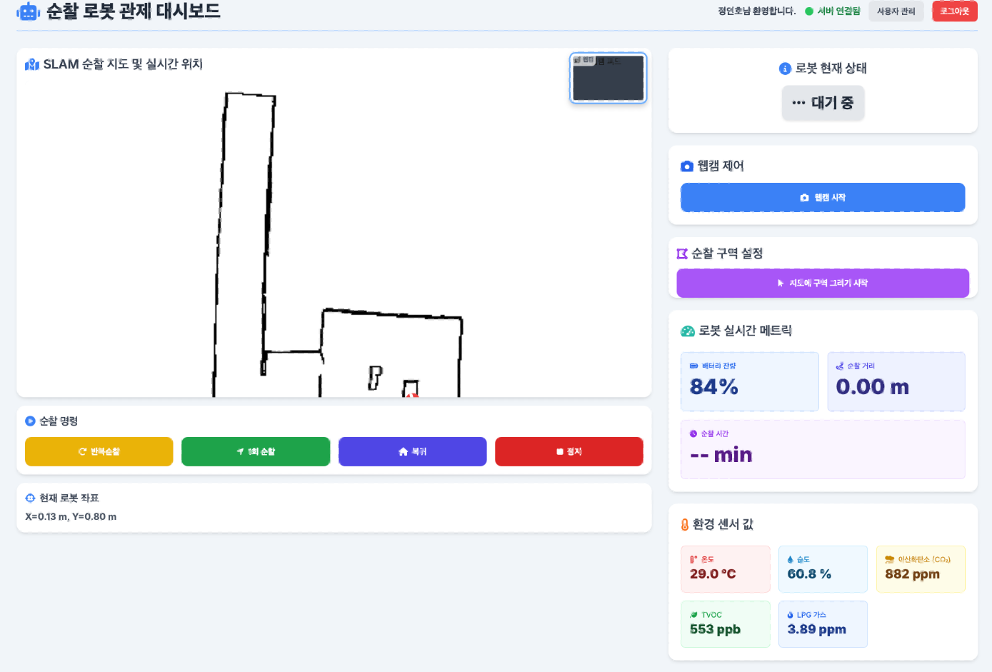

# 자율주행 방범로봇
### 스마트코어 팀 자율주행 방범로봇 프로젝트

이 프로젝트는 실내 자율 순찰·화재 감지·실시간 웹 관제가 가능한 ROS2 기반 보안 로봇 시스템입니다.  

-------------------------------------
# 핵심 기능
- 로봇 기능 (Raspberry Pi + TurtleBot3)
- SLAM & Navigation2 기반 자율주행
- turtlebot3_navigation2 패키지를 이용한 목표지점 이동 / 순찰
- 실시간 맵 + 로봇 위치(amcl_pose) 전송
- 화재/가스/온습도 센서 값 ROS2 토픽 발행
- 실시간 USB 카메라 스트리밍(web_video_server)

--------------------------------------
# 웹 관제 기능 (EC2 FastAPI)

- 실시간 맵 랜더링
- 로봇 위치 + 방향 표시 (```WorldToPixel()```, canvas scale/offset 적용)
- 순찰 구역 표시
- 실시간 배터리/센서 값 표시
- 버튼 형식 수동 제어
- 순찰 시작/정지/복귀 제어 명령
- 관리자 로그인 및 대시보드(UI)  

--------------------------------------
# 서버/네트워크 구조
- FastAPI WebSocket 서버 → EC2에서 상시 실시간 데이터 송출 가능
- Raspberry Pi → rosbridge_server → EC2로 WebSocket 터널링
- PostgreSQL(RDS)에서 사용자/로그 저장
- 프론트엔드는 ```wss://<EC2-IP>/ws/control```로 연결됨

--------------------------------------
# 실행 준비
- 라즈베리파이 Ros2 Humble 설치
- 의존성 패키지 설치 ```pip install -r requirements.txt```

--------------------------------------
# 실행 순서
### Raspberry Pi
- bringup 실행 ```ros2 launch turtlebot3_bringup robot_launch.py```
  
- 카메라 노드 실행 
```  
ros2 run v4l2_camera v4l2_camera_node \  
  --ros-args -p video_device:=/dev/video0 \  
             -p image_size:="[320,240]" \  
             -p frame_rate:=10  
```

- 웹캠 스트리밍 ```ros2 run web_video_server web_video_server```
  
- rosbridge 실행 ```ros2 launch rosbridge_server rosbridge_websocket_launch.xml \
  address:=0.0.0.0 port:=9090```
    
- 센서 ROS 토픽 발행 ```ros2 run sensor_bridge serial_publisher```
  
- EC2 터널링 ```ssh -N -R 9090:127.0.0.1:9090 ubuntu@<EC2-IP>```

### Vmware
- 자율주행 nav2 실행 ```ros2 launch turtlebot3_navigation2 navigation2.launch.py map:=$HOME/maps/map_13.yaml```
  
- 순찰 기능 실행 ```ros2 run patrol_system patrol_manager —ros-args -p waypoint_file:=$HOME/ros2_ws/src/patrol_system/config/waypoints.yaml ```

### EC2
- FastAPI 서버 실행 ```uvicorn main:app --host 0.0.0.0 --port 8000```

### 실행 순서 요약
#### Raspberry Pi

1. bringup

2. camera node

3. web_video_server

4. rosbridge_server

5. 센서 노드

6. EC2 reverse 터널링

#### VMware
1. Slam 또는 Nav2 실행

2. Patrol manager 실행

#### EC2
1. FastAPI 서버 실행

2. ```https://<EC2-IP>/``` 접속


-------------------------------------
## 참고 자료

터틀봇3 E-manual: https://emanual.robotis.com/docs/en/platform/turtlebot3/overview/  
Robotis E-manual: https://emanual.robotis.com/docs/en/platform/turtlebot3/slam/  
Slam_Navigation2: https://docs.nav2.org/tutorials/docs/navigation2_with_slam.html  
Ros2 Humble: https://github.com/ros2  
foxglove: https://github.com/foxglove  
Rosbridge: https://github.com/ros2/ros1_bridge  
FastAPI: https://github.com/fastapi/fastapi  